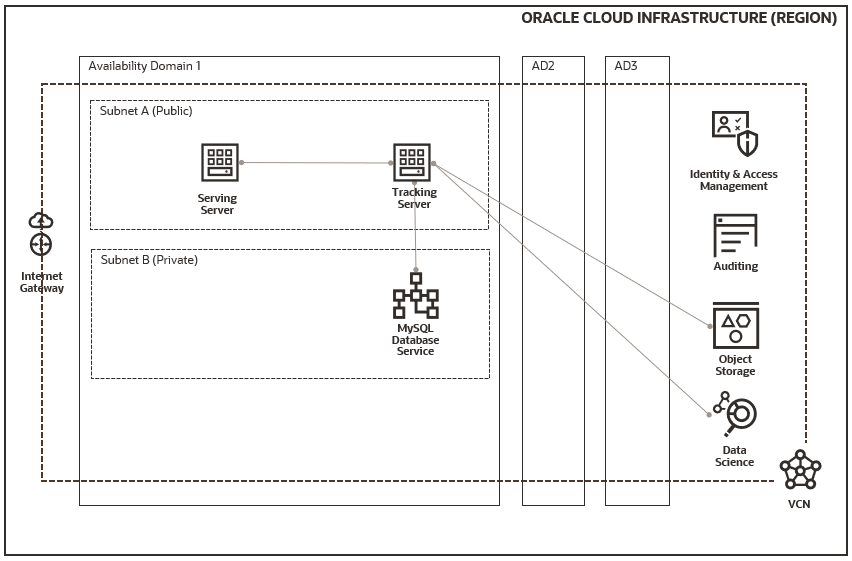

# oci-mlflow

MLflow is an open source platform to manage the ML lifecycle, including experimentation, reproducibility, deployment, and a central model registry.

MLflow is library-agnostic. You can use it with any machine learning library, and in any programming language, since all functions are accessible through a REST API and CLI. For convenience, the project also includes a Python API, R API, and Java API.

In the following sections, we will show how to deploy MLflow on OCI and use the components in your machine learning applications with Docker containers for tracking, training, and serving. In a typical machine learning workflow, you can track experiment runs and models with MLflow. 

You can also integrate MLflow with OCI Data Science service and OCI AI Services (e.g., tracking artifacts, parameters, metrics, and model, etc).


## Prerequisites

Permission to `manage` the following types of resources in your Oracle Cloud Infrastructure tenancy: `vcns`, `internet-gateways`, `route-tables`, `security-lists`, `subnets`, `buckets`, and `mysql-instances`.

Quota to create the following resources: 1 VCN, 1 subnet, 1 Internet Gateway, 1 route rules, 1 MySQL Database Service, 1 Object Storage bucket, and 4 compute instances.

If you don't have the required permissions and quota, contact your tenancy administrator. See [Policy Reference](https://docs.cloud.oracle.com/en-us/iaas/Content/Identity/Reference/policyreference.htm), [Service Limits](https://docs.cloud.oracle.com/iaas/Content/General/Concepts/resourcequotas.htm), and [Compartment Quotas](https://docs.cloud.oracle.com/iaas/Content/General/Concepts/resourcequotas.htm).


## Deploy Using the Terraform CLI

First off we'll need to do some pre deploy setup.  That's all detailed [here](https://github.com/oracle/oci-quickstart-prerequisites).

Secondly, create a provider.auto.tfvars file (`cp provider.auto.tfvars.template provider.auto.tfvars`) and set all the parameters in the file. For s3 parameters you can reference [here](https://docs.oracle.com/en-us/iaas/Content/Object/Tasks/s3compatibleapi.htm).

You might need to update `userdata\docker\requirements-training.txt` files with required dependencies for your specific machine learning applications with Python. You can also install extra Python packages in the docker containers later. 

Make sure you have terraform v0.14+ cli installed and accessible from your terminal.

### Build

At first time, you are required to initialize the terraform modules used by the template with  `terraform init` command:

```bash
$ terraform init

Initializing the backend...

Initializing provider plugins...
- Finding latest version of hashicorp/archive...
- Installing hashicorp/archive v2.1.0...
- Installed hashicorp/archive v2.1.0 (signed by HashiCorp)

Terraform has created a lock file .terraform.lock.hcl to record the provider
selections it made above. Include this file in your version control repository
so that Terraform can guarantee to make the same selections by default when
you run "terraform init" in the future.

Terraform has been successfully initialized!

You may now begin working with Terraform. Try running "terraform plan" to see
any changes that are required for your infrastructure. All Terraform commands
should now work.

If you ever set or change modules or backend configuration for Terraform,
rerun this command to reinitialize your working directory. If you forget, other
commands will detect it and remind you to do so if necessary.
```

Once terraform is initialized, just run the following commands to preview and create the resources:

```bash
$ terraform plan
$ terraform apply
```

You can find the IPs of compute instances (tracking, training, and serving) from the Terraform output values:

```bash
...
compute_linux_instances = {
  "serving" = {
    "id" = "ocid1.instance.oc1..."
    "ip" = "..."
  }
  "tracking" = {
    "id" = "ocid1.instance.oc1..."
    "ip" = "..."
  }
  "training" = {
    "id" = "ocid1.instance.oc1..."
    "ip" = "..."
  }
}
...
```

You then ssh to each compute instances and follow the instructions in "~/commands.txt" to start the dockers, and start MLflow tracking server. 

The MLflow tracking server has two components for storage: a backend store and an artifact store. We use a MySQL Database Service instance as the backend store and an Object Storage bucket as the artifact store.


## Verify the Deployment

We will showcases how you can use MLflow end-to-end with MLflow sample applications [sklearn_elasticnet_wine](https://github.com/mlflow/mlflow/tree/master/examples/sklearn_elasticnet_wine).

### Training the Models

1. Create a OCI Data Science [notebook session](https://docs.oracle.com/en-us/iaas/data-science/using/manage-notebook-sessions.htm) to access a JupyterLab interface using a customizable compute, storage, and network configuration. Add `MLFLOW_TRACKING_URI`, `MLFLOW_S3_ENDPOINT_URL`, `AWS_ACCESS_KEY_ID` and `AWS_SECRET_ACCESS_KEY` custom environment variables to your notebook session. Use the machine learning libraries in the JupyterLab interface to complete all steps in [train.ipynb](https://github.com/mlflow/mlflow/blob/master/examples/sklearn_elasticnet_wine/train.ipynb). 

2. Run [train.py](https://github.com/mlflow/mlflow/blob/master/examples/sklearn_elasticnet_wine/train.py) inside the training docker. Try out some different values for alpha and l1_ratio by passing them as arguments:
```bash
python train.py <alpha> <l1_ratio>
```

### Comparing the Models

Use the MLflow UI (`http://<tracking.ip>:5000`) to compare the models that you have produced. On this page, you can see a list of experiment runs with metrics you can use to compare the models.

Select a model, go to the model run page and copy the logged_model path (`runs:/<run_uuid>/model`).

The model run page also shows you the code snippets to demonstrate how to make predictions using the logged model.

### Serving the Model

Follow the instruction in "~/commands.txt" on the serving compute instance to deploy a local REST server that can serve predictions using the model-uri.

For models created by the MLflow sample `sklearn_elasticnet_wine`, you can make requests to `POST` `/invocations` in pandas split or record-oriented formats. 

Once you have deployed the server, you can pass it some sample data and see the predictions.

```bash
curl -X POST -H "Content-Type:application/json; format=pandas-split" --data '{"columns":["fixed acidity","volatile acidity","citric acid","residual sugar","chlorides","free sulfur dioxide","total sulfur dioxide","density","pH","sulphates","alcohol"],"data":[[6.2, 0.66, 0.48, 1.2, 0.029, 29, 75, 0.98, 3.33, 0.39, 12.8]]}' http://<serving.ip>:1234/invocations
```

You should see the output of wine quality in the response.

If you want to use a different port, you will need to add firewall rules on the serving compute instance.

## Destroy the Deployment 

When you no longer need the MLflow environment, you can run this command to destroy the resources:

```bash
terraform destroy
```

## Architecture Diagram



